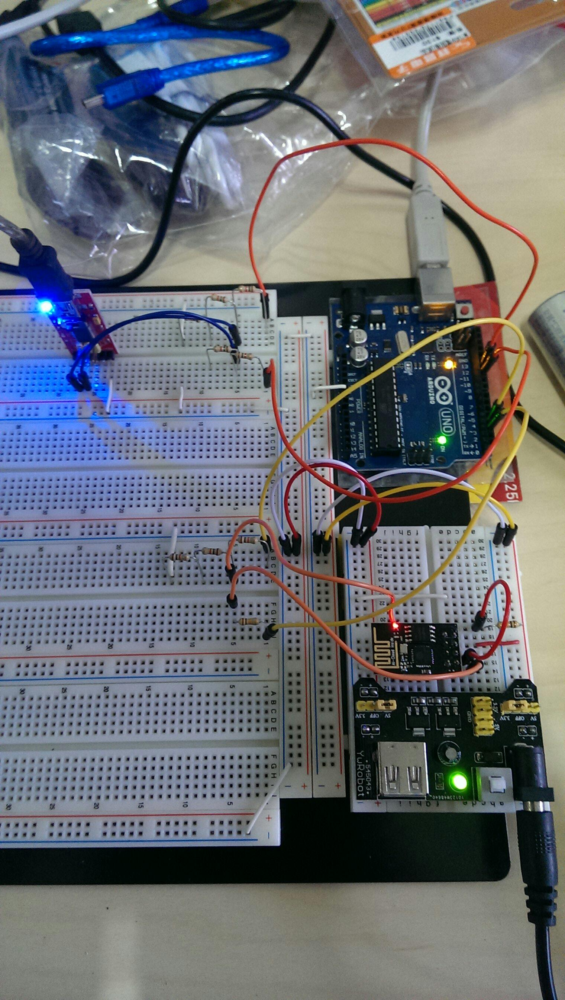

Project Name: 
==============

Installation and Usage
=============

### 1. 

### Tutorial:

### Chinese Tutorial:

敬翔改寫可以執行兩組 SoftwareSerial 給 ESB8266 及 FT232RL 使用
其中要注意使用 SoftwareSerial 的 read ( ) 函數的時候，因為是模擬的，會 read 比較慢，但又因為 write ( ) 函數有一個特性：會在還沒有 read 完時就會發送，就會產生亂碼。
所以我們就需要在 SoftwareSerial 的 read 加上一組短時間的 delay，才不會產生亂碼

電路接法：

【YuRoboot】3.3V →【ESP8266】VCC
 【YuRoboot】3.3V → 10K 電阻直接串接 →【ESP8266】CH_PD
 【YuRoboot】GND →【ESP8266】GND

 【YuRoboot】GND →【Arduino】GND

【Arduino】TX（此處由 D3 模擬）（5V 注意）→與 2K + 1K 電阻串接接地 → 取 2K 電阻電壓給【ESP8266】URXD（因為 ESP8266 只能吃 3.3V）
【Arduino】RX（此處由 D2 模擬）→ 10K 電阻直接串接 →【ESP8266】UTXD

【Arduino】TX（此處由 D11 模擬）（5V 注意）→ 與 2K + 1K 電阻串接接地 → 取 2K 電阻電壓給【FT232RL（3V 模式）】RXD
【Arduino】RX（此處由 D10 模擬）（5V 注意）→ 與 2K + 1K 電阻串接接地 → 取 2K 電阻電壓給【FT232RL（3V 模式）】TXD

 【YuRoboot】GND →【FT232RL】GND →【Arduino】GND

Inspired By
=============

License
=============

opyright {yyyy} Sean Chen

Licensed under the Apache License, Version 2.0 (the "License");
you may not use this file except in compliance with the License.
You may obtain a copy of the License at

http://www.apache.org/licenses/LICENSE-2.0

Unless required by applicable law or agreed to in writing, software
distributed under the License is distributed on an "AS IS" BASIS,
WITHOUT WARRANTIES OR CONDITIONS OF ANY KIND, either express or implied.
See the License for the specific language governing permissions and
limitations under the License.